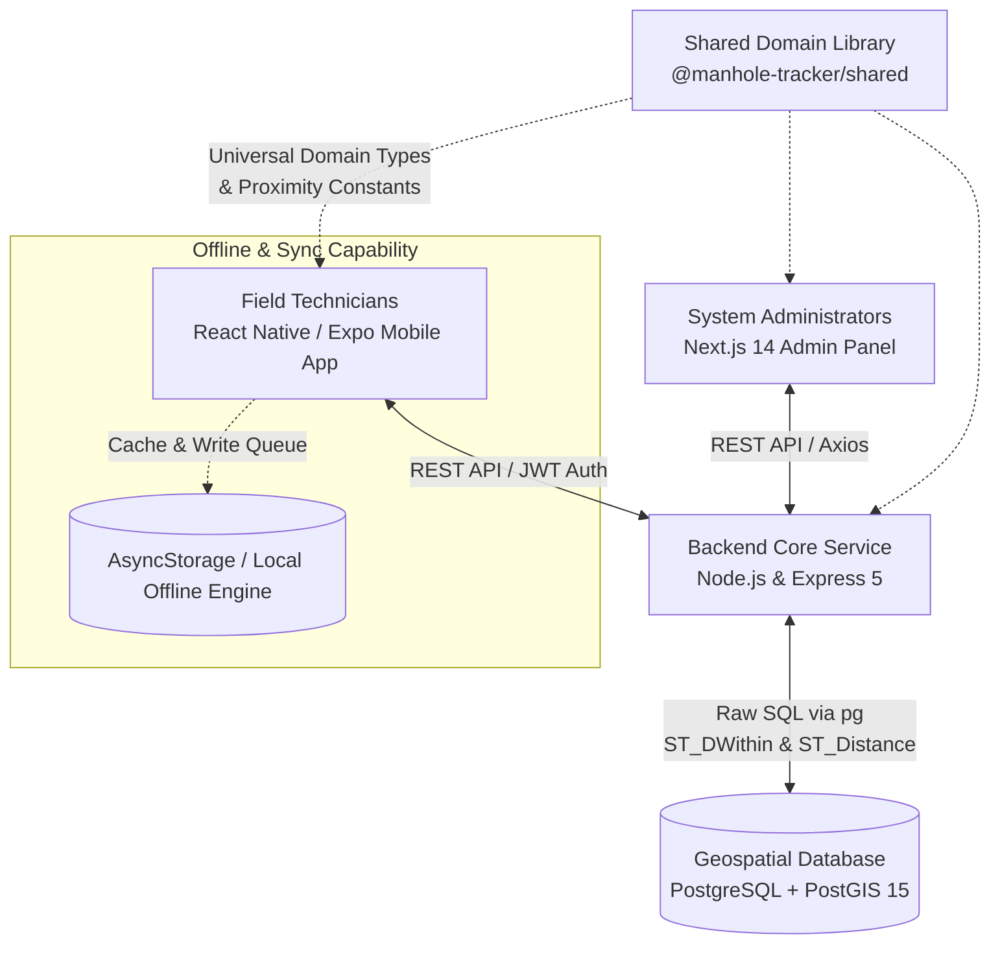

# 🕳️ Manhole Tracker

<div align="center">
  <p><strong>A full-stack, geospatial mobile & web platform for locating and managing critical underground utility infrastructure in real time.</strong></p>

  [](https://expo.dev/)
  [](https://nextjs.org/)
  [](https://nodejs.org/)
  [](https://postgis.net/)
  [](https://www.typescriptlang.org/)
  [](https://pnpm.io/)
  [](LICENSE)
</div>

---

## 📍 Overview & Problem Statement

### The Challenge
Field technicians frequently struggle to locate utility manholes that have become obscured or hidden due to soil accumulation, dense overgrowth, road resurfacing, or ongoing construction. In emergency maintenance or routine inspection scenarios, spending valuable time hunting for buried physical infrastructure delays critical field operations.

### Our Solution & Core Differentiator
**Manhole Tracker** solves this problem by enabling field technicians to register asset coordinates via high-precision GPS during initial surveys or installations, and subsequently relocate them in the field with unprecedented ease.

> **✨ Core Differentiator — Automated Real-Time Proximity Filtering:**
> Unlike traditional mapping software that requires manual panning, search queries, or static filter toggling, Manhole Tracker dynamically pivots around the technician. **As a technician physically moves through a worksite, nearby manholes automatically re-sort in real time — effortlessly bubbling the closest asset to the top of the queue.**

---

## 🏛️ System Architecture

The ecosystem connects field operators on mobile devices and central supervisors on a web dashboard to a unified PostGIS geospatial backend.



---

## 📦 Monorepo Structure

This codebase is organized as a high-performance **PNPM Workspaces Monorepo** configured completely with ECMAScript Modules (`"type": "module"`).

```
manhole-tracker/
├── apps/
│   ├── mobile/         # React Native mobile client for field technicians (Expo SDK 54, Expo Router, Zustand)
│   ├── backend/        # Node.js + Express 5 REST API & PostGIS geospatial indexing query engine
│   └── admin/          # Next.js 14 Web Admin Dashboard powered by React Google Maps & Tailwind CSS
├── packages/
│   └── shared/         # Single-source-of-truth domain types, utility categories, and proximity constants (@manhole-tracker/shared)
├── docker-compose.yml  # Local PostGIS database container configuration
├── pnpm-workspace.yaml # PNPM monorepo config
└── package.json        # Unified dev, setup, and maintenance orchestration scripts
```

---

## ✨ Key Features & Capabilities

### 📱 Field Technician Mobile App (`apps/mobile`)
- **Automated GPS Proximity Sorting:** Continuous live calculation of distance to utility assets using device geolocation; closest items prioritize instantly.
- **Offline Resilience & Sync-on-Reconnect:** Built for remote work sites. Nearby asset lists are aggressively cached in local storage via `AsyncStorage`. Inspections and registrations conducted offline are staged in an offline write queue and automatically synchronize when `@react-native-community/netinfo` detects restored connectivity.
- **Comprehensive Asset & Inspection Logging:** Capture GPS location, physical depth (meters), utility classification (`sewer`, `electrical`, `telecom`, `water`), asset status, notes, and photographic evidence.
- **Modern File-Based Navigation:** Powered natively by **Expo Router**, completely avoiding bloated direct navigation implementations.

### 🌐 Admin & Supervisor Dashboard (`apps/admin`)
- **Web-Based Oversight:** Developed on **Next.js 14** and **Tailwind CSS**.
- **Visual Asset Map:** Interactive mapping view (`@vis.gl/react-google-maps`) displaying regional deployed infrastructure, historic inspection trails, and technician assignment status.
- **Bulk Infrastructure Management:** Search, audit, and filter municipal or organizational utility data centrally.

### ⚙️ High-Performance Geospatial API (`apps/backend`)
- **Raw SQL for PostGIS Performance:** Eschews heavy ORMs in favor of direct, highly-optimized raw SQL queries via `pg`, maximizing geospatial computation speeds.
- **Secure by Default:** JWT authentication, bcrypt password hashing, and strict role validation.
- **External Object Storage Ready:** Pre-configured multipart processing (`multer`) to store photographic evidence off-database in scalable Cloudinary, AWS S3, or Firebase buckets, persisting clean `photo_url` references in Postgres.

---

## 🛠️ Tech Stack & Domain Layering

| Layer | Technologies & Conventions |
| :--- | :--- |
| **Monorepo / Build** | **PNPM Workspaces**, **TypeScript** (Strict), ES Modules (`ESM`), Git Pre-commit formatting |
| **Mobile Client** | **React Native** (Expo SDK 54), **Expo Router** (File-based routing), **Zustand** (State management), **Axios**, **AsyncStorage** |
| **Admin Web Portal** | **Next.js 14**, **Tailwind CSS**, **@vis.gl/react-google-maps**, **TypeScript** |
| **Backend REST API** | **Node.js** `>=20.19.0`, **Express 5**, **jsonwebtoken**, **bcrypt**, **multer**, **pg** |
| **Geospatial Engine** | **PostgreSQL 15**, **PostGIS** extension, **GiST Spatial Indexing**, Docker & Docker Compose |
| **Domain Sharing** | Scoped `@manhole-tracker/shared` workspace library containing shared schemas and `UTILITY_TYPES` |

---

## 🚀 Getting Started & Local Development

### Prerequisites
- [Node.js](https://nodejs.org/) (`v20.19.0` or higher)
- [PNPM](https://pnpm.io/) (`v8` or higher recommended)
- [Docker](https://www.docker.com/) & **Docker Compose** (for running the PostGIS database locally)
- [Expo Go](https://expo.dev/go) application on your iOS/Android device, or an active mobile simulator/emulator.

### 1. Installation
Clone the repository and bootstrap workspace dependencies from the project root:
```bash
git clone https://github.com/Chu29/manhole-tracker.git
cd manhole-tracker
pnpm install
```

### 2. Environment & Database Setup
Spin up the localized Docker PostGIS container and run backend database schema migrations in one automated command:
```bash
# Spins up PostgreSQL+PostGIS via Docker Compose and applies database migrations
pnpm run setup:local
```

*(Alternatively, you can manage the database container directly using `pnpm run db:up` and `pnpm run db:down`)*.

### 3. Launching Development Servers
Open multiple terminals (or use a multiplexer like `tmux`) to launch the application services concurrently from the repository root:

```bash
# Terminal 1: Launch Backend REST API Server (with hot reloading via nodemon)
pnpm run backend:dev

# Terminal 2: Launch Expo Mobile Application Dev Server
pnpm run mobile

# Terminal 3: Launch Next.js Admin Portal
pnpm run dev:admin
```

---

## 🔍 Under the Hood: Geospatial Proximity Engine

To support instantaneous proximity ranking as technicians move through complex work zones, the backend leverages **PostGIS** spatial geometry types and **GiST (Generalized Search Tree)** indexing on a `GEOGRAPHY(POINT, 4326)` column.

Instead of computing spherical trigonometric distances (Haversine formula) across thousands of records in slow application code, our core backend engine evaluates distance sorting natively at the database layer with sub-millisecond precision:

```sql
SELECT
  id, code, utility_type, status, photo_url,
  ST_Y(location::geometry) AS lat,
  ST_X(location::geometry) AS lng,
  ST_Distance(location, ST_MakePoint($1, $2)::geography) AS distance_meters
FROM manholes
WHERE ST_DWithin(location, ST_MakePoint($1, $2)::geography, $3)
ORDER BY distance_meters ASC;
```
*(Where `$1` = Longitude, `$2` = Latitude, and `$3` = Proximity Radius in meters).*

---

## 🎓 Academic Context & Attribution

This project was engineered and prototyped as a **Final Year B.Tech Software Engineering Project**. It demonstrates advanced real-world software engineering competencies, including microservice/monorepo architectural partitioning, offline network synchronization algorithms, secure JWT authentication flows, mobile UI design, and geospatial database optimization.

## 📄 License

This project is open-sourced under the **ISC License**. See individual package specifications for third-party dependency licensing details.
